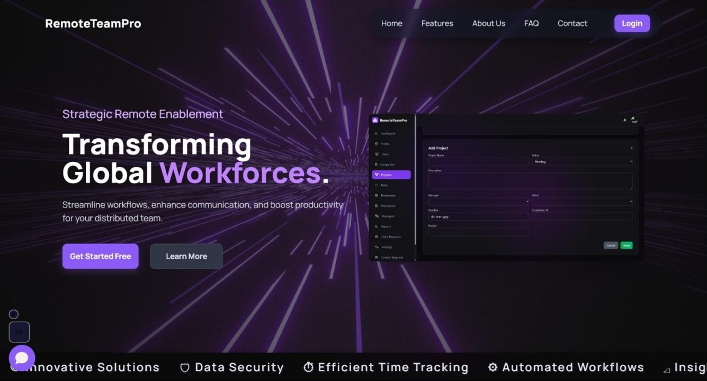
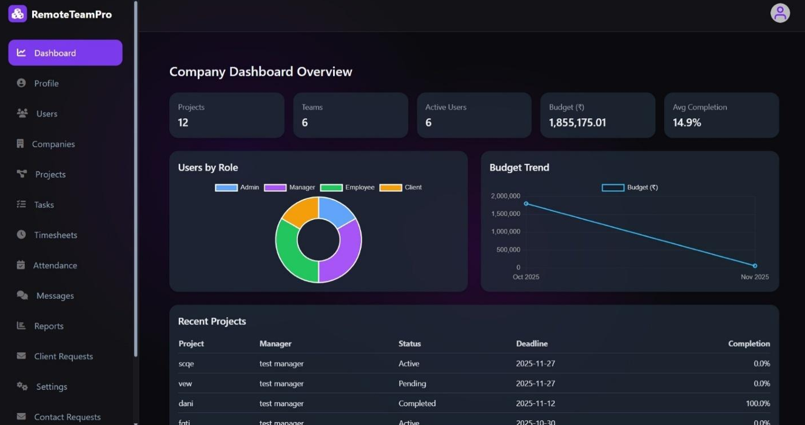
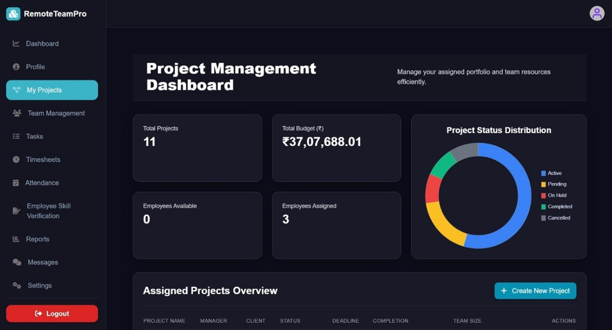
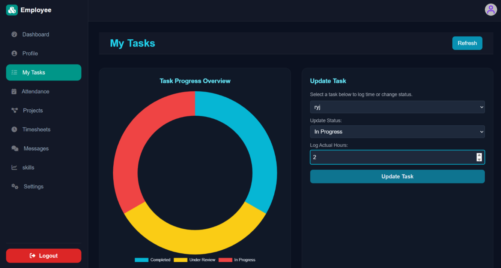
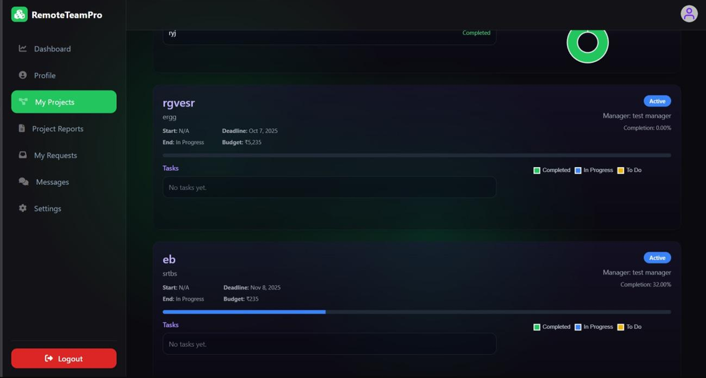

# RemoteTeamPro

**A lightweight, self-hosted Remote Team Management System** — built with PHP & MySQL for small to medium teams.  
Centralizes project coordination, task tracking, attendance & timesheets, internal messaging, notifications, client portals, and basic reporting — all without subscriptions or cloud dependency.

Run it locally with XAMPP or on any shared LAMP/LEMP host.

[](https://php.net)  
[](https://mysql.com)  
[](https://opensource.org/licenses/MIT)

[Key Features](#-key-features) • [Technology Stack](#-technology-stack) • [User Roles](#-user-roles--functionalities) • [Installation](#-installation-and-configuration) • [Usage](#-usage) • [API Documentation](#-api-documentation) • [Troubleshooting](#-troubleshoot) • [Contributing](#-contributing) • [Contributors](#-contributors) • [License](#license)

## Screenshots
  
*Home / Landing Page – Welcome screen with login/register options*


*Admin dashboard with analytics, user management, and reports*


*Manager view: creating projects, assigning tasks, monitoring team progress*


*Employee interface: updating task status, logging attendance & hours*


*Client portal: viewing milestones, downloading reports, messaging manager*

## ✨ Key Features

- **Role-Based Access Control (RBAC)** — Four roles: Admin, Manager, Employee, Client — each with tailored dashboards and strict permissions  
- **User Management** — Secure registration with OTP email verification, password reset, profile picture upload, activity logging  
- **Project & Task Management** — Create projects, assign tasks with deadlines, track real-time progress and status updates  
- **Attendance & Timesheets** — Check-in/out logging, task-linked hours, manager review, automatic cron-based checkout for open sessions  
- **Internal Messaging** — Role-aware conversations, send/fetch messages, mark as read, auto-seeded conversations for new users  
- **Notifications** — In-app alerts + email notifications for tasks, deadlines, messages (via PHPMailer)  
- **Client Portal** — Project timelines, milestone tracking, report downloads, direct manager communication  
- **Reporting** — Generate and export PDF reports (Dompdf), timesheet exports, performance analytics  
- **Advanced Auth** — OTP flows for login, registration, password reset, email change verification  
- **Responsive & Clean UI** — Works on desktop, tablet, mobile

## 💻 Technology Stack

- **Backend** — PHP (7.4+ recommended)  
- **Database** — MySQL / MariaDB  
- **Frontend** — HTML5, CSS3, JavaScript (vanilla + custom loaders & notification scripts)  
- **Libraries**  
  - PHPMailer — reliable email / OTP delivery  
  - Dompdf — PDF report generation  
- **Tools** — Composer for dependency management, XAMPP for local development  
- **Server** — Apache (XAMPP) or any LAMP/LEMP stack

## 👥 User Roles & Functionalities

### Admin
- Full control: manage users, companies, projects, settings  
- View activity logs, handle contact requests, generate reports  
- System configuration (SMTP, notifications, etc.)

### Manager
- Create/assign projects & tasks, monitor team progress  
- Review attendance, timesheets, client requests  
- Communicate with employees and clients

### Employee
- View & update assigned tasks/projects  
- Log daily attendance and task hours  
- Send/receive messages, manage profile

### Client
- View assigned project timelines and progress  
- Download reports/PDFs  
- Direct messaging with assigned manager  
- Receive automated notifications

## 🛠️ Installation and Configuration

### Prerequisites
- XAMPP (Apache + MySQL + PHP ≥7.4)  
- Composer  
- Git (optional)  
- VS Code or any code editor

1. **Clone / Extract the project**  
   Place the folder in your web root (e.g. `C:\xampp\htdocs\RemoteTeamPro`)

   ```bash
   git clone https://github.com/yourusername/RemoteTeamPro.git
   ```

2. **Install dependencies**

   ```bash
   composer install
   ```

3. **Database Setup**

   - Start Apache & MySQL in XAMPP  
   - Open http://localhost/phpmyadmin  
   - Create a new database (e.g. `remoteteampro`)  
   - Import `database/schema.sql`

4. **Configure the application**

   - Edit `backend/config/database.php` — set DB host, username, password, database name  
   - Edit `backend/config/smtp.php` — configure Gmail / SMTP credentials (App Password recommended for Gmail)  
   - Make sure `uploads/profile_pictures/` is writable (chmod 755 or 775)

5. **Launch**

   Open browser:  
   http://localhost/RemoteTeamPro

   Complete initial setup (create first company/admin via the UI).

For production: secure config files, enable HTTPS, harden permissions.

## 🚀 Usage

- Start XAMPP (Apache + MySQL)  
- Go to http://localhost/RemoteTeamPro  
- Register a new account (OTP verification required) or log in  
- Create a company → invite users → start managing projects/tasks

**Cron Job (recommended)**  
Schedule auto-checkout for unfinished attendance:

```bash
# Example: run every day at midnight
0 0 * * * /usr/bin/php /path/to/RemoteTeamPro/backend/api/attendance/auto-checkout-cron.php
```

## 🔌 API Documentation

The backend exposes REST-like endpoints in `backend/api/`. All endpoints require authentication (session or OTP) and use JSON for requests/responses. Base URL: `/RemoteTeamPro/backend/api/`.

Endpoints are grouped by category. Use POST for most actions. Always include CSRF token where applicable.

### Auth Endpoints
Handles login, registration, OTP verification, password reset, etc.

| Endpoint | Method | Description | Parameters | Response |
|----------|--------|-------------|------------|----------|
| `auth/login.php` | POST | User login | `email`, `password` | `{ "success": true, "user": {...} }` or error |
| `auth/register.php` | POST | Register new user | `email`, `password`, `role` | Success with OTP sent |
| `auth/verify-otp.php` | POST | Verify OTP | `otp`, `email` | `{ "verified": true }` |
| `auth/forgot-password.php` | POST | Request password reset | `email` | OTP sent |
| `auth/reset-password.php` | POST | Reset password | `otp`, `new_password` | Success |
| `auth/logout.php` | POST | Logout user | None | `{ "logged_out": true }` |
| `auth/change-email.php` | POST | Change email | `new_email` | OTP sent for verification |

### Attendance Endpoints
For logging and managing attendance/timesheets.

| Endpoint | Method | Description | Parameters | Response |
|----------|--------|-------------|------------|----------|
| `attendance/attendance-employee.php` | POST | Employee check-in/out | `action: 'checkin' or 'checkout'`, `task_id` (optional) | `{ "status": "checked_in" }` |
| `attendance/attendance-manager.php` | GET | Manager view timesheets | `employee_id` (optional) | Array of timesheets |
| `attendance/auto-checkout-cron.php` | GET | Auto-checkout open sessions (cron) | None | Success log |

### Messages Endpoints
For internal chat and notifications.

| Endpoint | Method | Description | Parameters | Response |
|----------|--------|-------------|------------|----------|
| `messages/send_message.php` | POST | Send message | `conversation_id`, `message` | `{ "sent": true }` |
| `messages/fetch_messages.php` | GET | Fetch chat history | `conversation_id` | Array of messages |
| `messages/fetch_conversations.php` | GET | List conversations | None | Array of conversations |
| `messages/mark_read.php` | POST | Mark message read | `message_id` | Success |

### Reports Endpoints
For generating and exporting reports.

| Endpoint | Method | Description | Parameters | Response |
|----------|--------|-------------|------------|----------|
| `reports/generate-report.php` | POST | Generate report | `type: 'timesheet' or 'project'`, `filters` | Report data |
| `reports/export-pdf.php` | GET | Export as PDF | `report_id` | PDF file download |
| `reports/send-report-mail.php` | POST | Email report | `report_id`, `email` | Success |

### Other Endpoints
- `users.php` (GET/POST): Manage users (list/create/update)  
- `projects.php` (GET/POST): Manage projects/tasks  
- `dashboard/admin-dashboard.php` (GET): Admin stats  
- `profile/upload_profile_picture.php` (POST): Upload avatar  
- Full list: See `backend/api/` directory for all files.

**Notes:**  
- Authentication: Use session cookie after login.  
- Error Handling: Responses include `{ "error": "message", "code": 400 }`.  
- Rate Limiting: Not implemented; add in production.  
- Testing: Use Postman with base URL `http://localhost/RemoteTeamPro/backend/api/`.  
For full OpenAPI spec, generate with Swagger (future enhancement).

## ⚠️ Troubleshoot

**Email / OTP not sending**  
Causes & Fixes:  
1. Wrong Gmail address or App Password in `backend/config/smtp.php`  
2. Gmail blocked "less secure apps" — use App Password  
3. Run `composer update && composer install` if PHPMailer issues persist  

**Database connection error / Uncaught mysqli_sql_exception**  
Causes & Fixes:  
1. MySQL service stopped → start it in XAMPP  
2. Wrong credentials in `backend/config/database.php`  
3. Database not created or schema not imported  

**Pages not loading / blank**  
Causes & Fixes:  
1. PHP version < 7.4 → upgrade XAMPP  
2. Missing `vendor/` folder → run `composer install` again  
3. Check `backend/logs/` for detailed PHP errors

## 🤝 Contributing

Contributions are welcome!  
- Fork the repo  
- Create your feature branch (`git checkout -b feature/amazing-feature`)  
- Commit your changes (`git commit -m 'Add amazing feature'`)  
- Push to the branch (`git push origin feature/amazing-feature`)  
- Open a Pull Request  

Please update documentation / schema if needed.

## 🙏 Acknowledgements

- PHPMailer — powerful email library  
- Dompdf — clean PDF generation  
- Tailwind CSS & Chart.js — modern styling & visuals (if used)

## 👥 Contributors

Big thanks to the core team:

- [Ribin K Roy](https://github.com/Ryson-Theo) — Main Contributor  
- [Kevin Cyriac](https://github.com/kevincyriac-2005) — Co-Developer  

## License

Distributed under the **MIT License**.  
See [`LICENSE`](LICENSE) for full details.  
Free to use, modify, and distribute.